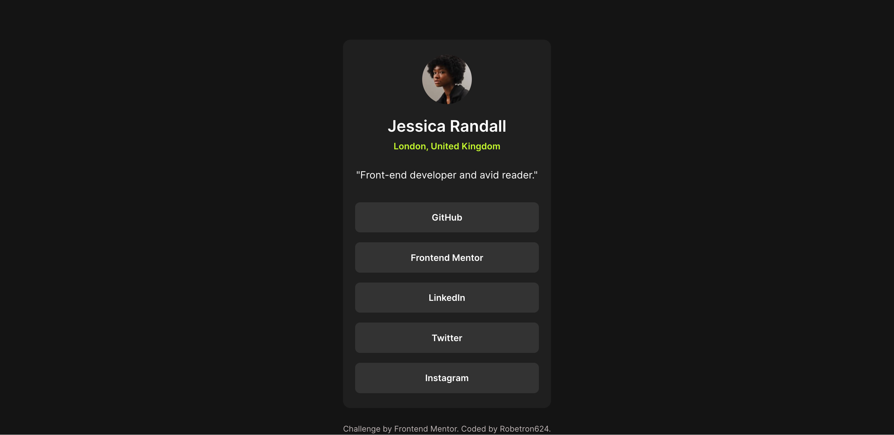

# Frontend Mentor - Social links profile solution

This is a solution to the [Social links profile challenge on Frontend Mentor](https://www.frontendmentor.io/challenges/social-links-profile-UG32l9m6dQ). Frontend Mentor challenges help you improve your coding skills by building realistic projects. 

## Table of contents

- [Overview](#overview)
  - [The challenge](#the-challenge)
  - [Screenshot](#screenshot)
  - [Links](#links)
- [My process](#my-process)
  - [Built with](#built-with)
  - [What I learned](#what-i-learned)
  - [Continued development](#continued-development)
- [Author](#author)

## Overview

### The challenge

Users should be able to:

- See hover and focus states for all interactive elements on the page

### Screenshot

### Links

- Solution URL: [Link](https://github.com/Robertron624/social-links-profile-main)
- Live Site URL: [Link](https://robertron624.github.io/social-links-profile-main/)

## My process

### Built with

- Semantic HTML5 markup
- CSS custom properties
- Flexbox
- CSS Grid
- Mobile-first workflow

### What I learned

Rememebering the basics of CSS and HTML is always a good thing to do. I learned that I need to practice more on my CSS skills and learn more about CSS Grid and Flexbox. 

### Continued development

I will continue to practice my CSS skills, speceally for layouts and positioning. I will also learn more about CSS Grid and Flexbox. 

## Author

- Website - [Robert Ramirez](https://www.robert-ramirez.co)
- Frontend Mentor - [@Robertron624](https://frontendmentor.io/profile/Robertron624)
- Github - [@Robertron624](https://github.com/Robertron624)
